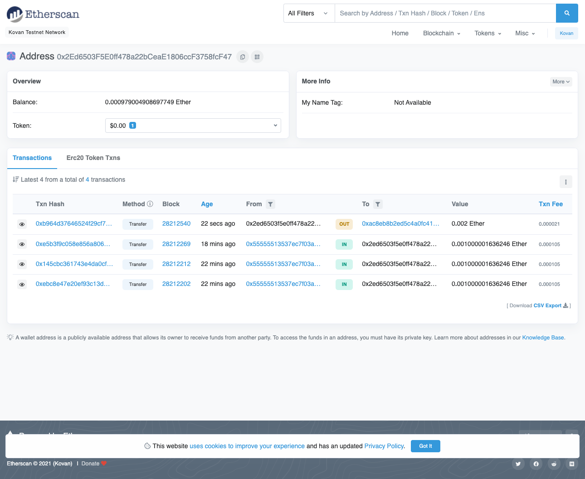
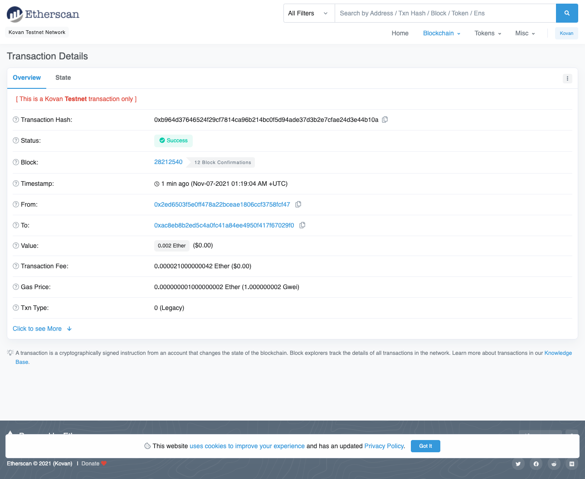
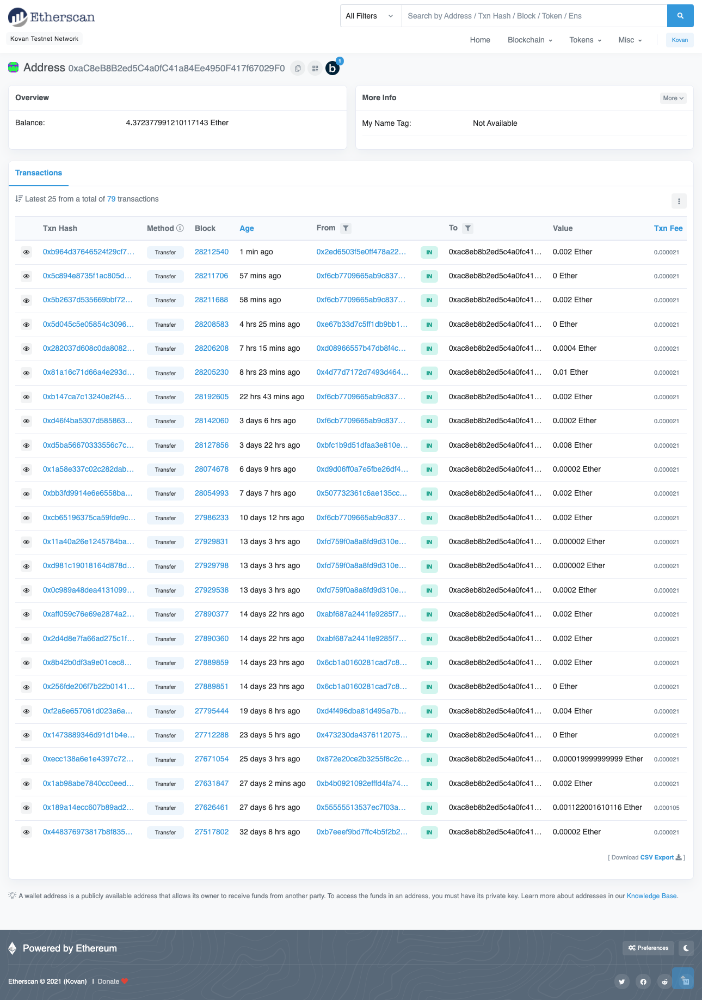

# Fintech Finder (module_19_challenge)

A python app that pays candidates an hourly wage in ethereum (kovan testnet network) via a web-based ui.

To run this app, rename `SAMPLE.env` to `.env`, enter your mneumonic phrase and [Infura](https://infura.io/) project id in the `.env` file, and start the app using the following command:

`streamlit run fintech_finder.py`

---

## Technologies

- python 3.7.10
- requests 2.25.1
- python-dotenv 0.18.0
- bip44 0.1.0
- web3 5.17.0
- streamlit 0.84.2
- typing_extensions 3.7.4.3

---

## Screenshots of Etherscan Results

### My Account on Etherscan

### Transaction Details on Etherscan

### Candidate Account on Etherscan

---

## Contributors

---

## License

GNU GPLv3
